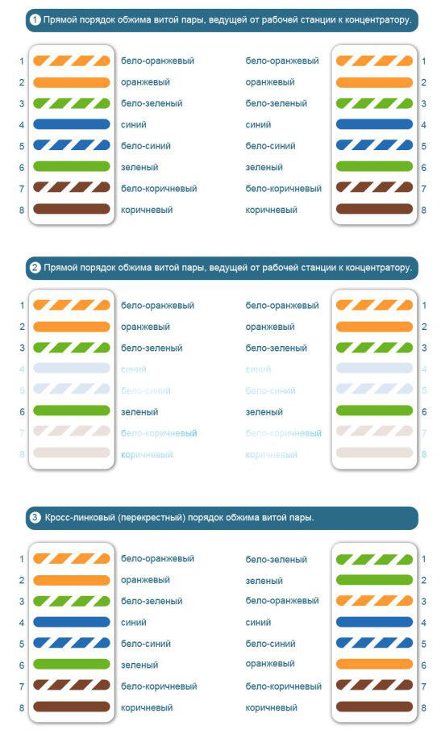

# 🪢 Справочник по обжиму витой пары

---

## 🇷🇺 Русская версия

В этом репозитории представлены основные схемы обжима витой пары (кабель RJ-45). Инструкция базируется на стандартных цветовых схемах для подключения сетевого оборудования.

### 1. Прямой порядок (от рабочей станции к концентратору) - 8 жил

Стандартный вариант подключения компьютера к коммутатору или роутеру. Обе стороны кабеля обжимаются одинаково:

| Контакт | Цвет (Сторона 1 и Сторона 2) | 
| ----- | ----- | 
| **1** | 🟧 Бело-оранжевый | 
| **2** | 🟧 Оранжевый | 
| **3** | 🟩 Бело-зеленый | 
| **4** | 🟦 Синий | 
| **5** | 🟦 Бело-синий | 
| **6** | 🟩 Зеленый | 
| **7** | 🟫 Бело-коричневый | 
| **8** | 🟫 Коричневый | 

### 2. Прямой порядок (от рабочей станции к концентратору) - 4 жилы

Бюджетный вариант (подходит для сетей до 100 Мбит/с). Используются только контакты 1, 2, 3 и 6. Остальные жилы можно не подключать.

| Контакт | Цвет (Сторона 1 и Сторона 2) | 
| ----- | ----- | 
| **1** | 🟧 Бело-оранжевый | 
| **2** | 🟧 Оранжевый | 
| **3** | 🟩 Бело-зеленый | 
| **4** | *Пусто* | 
| **5** | *Пусто* | 
| **6** | 🟩 Зеленый | 
| **7** | *Пусто* | 
| **8** | *Пусто* | 

### 3. Кросс-линковый (перекрестный) порядок

Используется для прямого соединения однотипного оборудования (например, напрямую от компьютера к компьютеру).

| Контакт | Сторона 1 | Сторона 2 | 
| ----- | ----- | ----- | 
| **1** | 🟧 Бело-оранжевый | 🟩 Бело-зеленый | 
| **2** | 🟧 Оранжевый | 🟩 Зеленый | 
| **3** | 🟩 Бело-зеленый | 🟧 Бело-оранжевый | 
| **4** | 🟦 Синий | 🟦 Синий | 
| **5** | 🟦 Бело-синий | 🟦 Бело-синий | 
| **6** | 🟩 Зеленый | 🟧 Оранжевый | 
| **7** | 🟫 Бело-коричневый | 🟫 Бело-коричневый | 
| **8** | 🟫 Коричневый | 🟫 Коричневый | 

---

### ⚠️ Условия использования / Отказ от отвественности

* **Личное использование:** Инструкции предоставляются бесплатно для частного ознакомления.
* **Авторство:** При цитировании или копировании материалов ссылка на данный репозиторий обязательна.
* **Запрет коммерции:** Запрещается продажа данных материалов или их использование в платных курсах без согласия автора.
* **Риски:** Все действия вы выполняете на свой страх и риск. Автор не несет ответственности за порчу имущества, травмы или иные последствия, возникшие в ходе следования инструкции.
* **Как есть:** Информация предоставляется «как есть» (as is). Автор не гарантирует пригодность инструкций для ваших конкретных целей.

---

**Авторские права © 2026 [Иван Бирючков / https://github.com/biryuchkov-ia]**

---

## 🇬🇧 English Version

# 🪢 Twisted Pair Crimping Guide

This repository provides standard pinout diagrams for crimping RJ-45 twisted pair cables.

### 1. Straight-Through (Workstation to Hub/Switch) - 8 Wires

The standard wiring for connecting a PC to a switch or router. Both ends of the cable are crimped identically:

| Pin | Color (Side 1 & Side 2) | 
| ----- | ----- | 
| **1** | 🟧 White-Orange | 
| **2** | 🟧 Orange | 
| **3** | 🟩 White-Green | 
| **4** | 🟦 Blue | 
| **5** | 🟦 White-Blue | 
| **6** | 🟩 Green | 
| **7** | 🟫 White-Brown | 
| **8** | 🟫 Brown | 

### 2. Straight-Through (Workstation to Hub/Switch) - 4 Wires

Used for networks up to 100 Mbps, utilizing only pins 1, 2, 3, and 6. The other wires are left unconnected.

| Pin | Color (Side 1 & Side 2) | 
| ----- | ----- | 
| **1** | 🟧 White-Orange | 
| **2** | 🟧 Orange | 
| **3** | 🟩 White-Green | 
| **4** | *Empty* | 
| **5** | *Empty* | 
| **6** | 🟩 Green | 
| **7** | *Empty* | 
| **8** | *Empty* | 

### 3. Crossover (PC to PC)

Used for direct connections between two similar devices (e.g., computer to computer, or switch to switch).

| Pin | Side 1 | Side 2 | 
| ----- | ----- | ----- | 
| **1** | 🟧 White-Orange | 🟩 White-Green | 
| **2** | 🟧 Orange | 🟩 Green | 
| **3** | 🟩 White-Green | 🟧 White-Orange | 
| **4** | 🟦 Blue | 🟦 Blue | 
| **5** | 🟦 White-Blue | 🟦 White-Blue | 
| **6** | 🟩 Green | 🟧 Orange | 
| **7** | 🟫 White-Brown | 🟫 White-Brown | 
| **8** | 🟫 Brown | 🟫 Brown | 

---

### ⚠️ Terms of Use / Disclaimer

* **Personal Use:** These instructions are provided free of charge for personal reference only.
* **Attribution:** When quoting or copying materials, a link to this repository is required.
* **No Commercial Use:** Selling these materials or using them in paid courses without the author's consent is prohibited.
* **Risk:** You perform all actions at your own risk. The author is not liable for any property damage, injuries, or other consequences arising from following these instructions.
* **As Is:** Information is provided "as is". The author does not guarantee that these instructions are suitable for your specific purposes.

---

**Copyright © 2026 [Ivan Biryuchkov / https://github.com/biryuchkov-ia]**

---